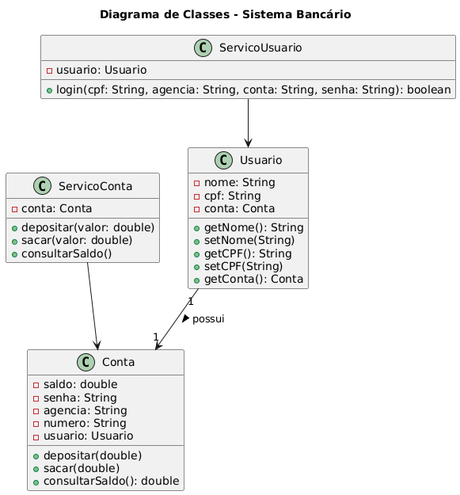

# Classe de Composição/Associação (Conta)
## Clique na imagem

[](./diagrama.bancario.puml)

 ```java
 package br.com.caioq.contabancaria.model;

public class Conta {
    private Usuario usuario;
    private double saldo;
    private String senha;
    private String agencia;
    private final String conta;

    public Conta(Usuario usuario, String senha, String agencia, String conta) {
        this.usuario = usuario;
        this.senha = senha;
        this.agencia = agencia;
        this.conta = conta;
        this.saldo = 0;
    }

    public Usuario getUsuario() {
        return usuario;
    }

    public double getSaldo() {
        return saldo;
    }

    public void setSaldo(double saldo) {
        this.saldo = saldo;
    }

    public String getSenha() {
        return senha;
    }

    public String getAgencia() {
        return agencia;
    }

    public String getConta() {
        return conta;
    }
}

 ```

# Classe de Composição/Associação (Usuario)
 + Poderia fazer dessa forma com Herança

```java
package br.com.caioq.contabancaria.model;

public class Usuario extends Conta {

    public Usuario(String nome, String cpf, String senha, String agencia, String conta) {
        super(nome, cpf, senha, agencia, conta);
    }

    // Getter e Setter específico de Usuario
}
```

+ Mas o Usuário não é uma conta, ele tem uma conta.

```java
package br.com.caioq.contabancaria.model;

public class Usuario {
    private final Conta conta;

    public Usuario(Conta conta) {
        this.conta = conta;
    }
    
    public Conta getConta() {
        return conta;
    }
}
```

# Serviços de Conta
```java
package br.com.caioq.contabancaria.service;

import br.com.caioq.contabancaria.model.Conta;

public class ServicoConta {
    private final Conta conta;

    public ServicoConta(Conta conta) {
        this.conta = conta;
    }

    public void sacar(double valor) {
        if (valor <= 0) {
            System.out.println("Valor inválido para saque!");
        } else if (valor > conta.getSaldo()) {
            System.out.println("Saldo insuficiente!");
        } else {
            conta.setSaldo(conta.getSaldo() - valor);
            System.out.printf("Saque realizado! Novo saldo: R$%.2f\n", conta.getSaldo());
        }
    }
    
    public void depositar(double valor) {
        if (valor <= 0) {
            System.out.println("Valor inválido para depósito!");
        } else {
            conta.setSaldo(conta.getSaldo() + valor);
            System.out.printf("Depósito realizado! Novo saldo: R$%.2f\n", conta.getSaldo());
        }
    }

    public void consultarSaldo() {
        System.out.printf("Saldo atual: R$%.2f\n", conta.getSaldo());
    }

    public Conta getConta() {
        return conta;
    }
}
```
# Serviço de Usuario

```java
package br.com.caioq.contabancaria.service;

import br.com.caioq.contabancaria.model.Usuario;

public class ServicoUsuario {
    final Usuario usuario;

    public ServicoUsuario(Usuario usuario) {
        this.usuario = usuario;
    }

    public boolean login(String cpf, String agencia, String conta, String senha) {
               
        if (usuario.getConta().getAgencia().equals(agencia) && 
            usuario.getConta().getConta().equals(conta) &&
            usuario.getConta().getSenha().equals(senha) &&
            usuario.getConta().getUsuario().getCPF().equals(cpf)
            ) {
            System.out.println("Usuário logado com sucesso!");
            return true;
        } else {
            System.out.println("Dados incorretos!");
            return false;
        }
    }
}
```